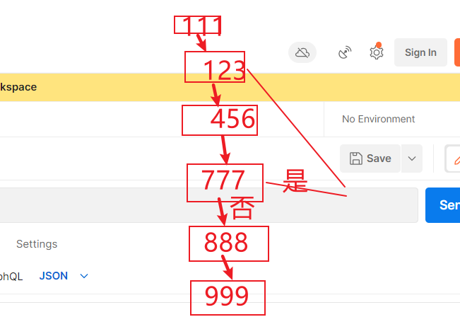

### 任务流调度中心
### 示例json

子任务流json
```
{
    "workflowId":2,
    "graph":"{\"nodes\": [{\"id\": \"123\", \"nodeType\": \"job\", \"jobType\": \"datax\", \"objectId\": 1, \"priorityLevel\": 3 }, {\"id\": \"456\", \"nodeType\": \"job\", \"jobType\": \"datax\", \"objectId\": 3, \"priorityLevel\": 3 }, {\"id\": \"777\", \"nodeType\": \"workflow\", \"jobType\": \"sub-workflow\", \"objectId\": 1, \"priorityLevel\": 3 } ], \"edges\": [{\"source\": \"123\", \"sourceAncheor\": 1, \"target\": \"777\", \"targetAnchor\": 1, \"index\": 1 }, {\"source\": \"777\", \"sourceAncheor\": 1, \"target\": \"456\", \"targetAnchor\": 1, \"index\": 1 } ] }"
}
```
循环json
```

```


